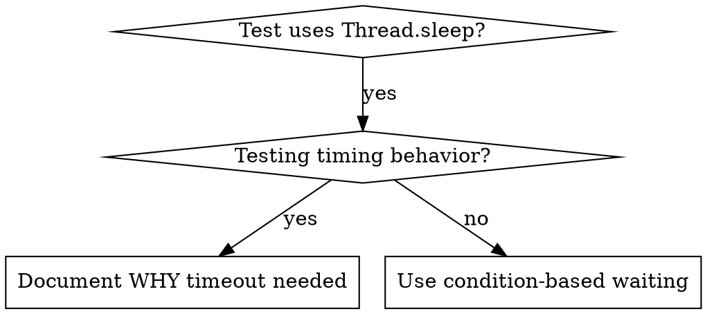

# Condition-Based Waiting

## Overview

Flaky tests often guess at timing with arbitrary delays. This creates race conditions where tests pass on fast machines but fail under load or in CI.

**Core principle:** Wait for the actual condition you care about, not a guess about how long it takes.

## When to Use



**Use when:**
- Tests have arbitrary delays (`Thread.sleep`, `TimeUnit.SECONDS.sleep`, `CountDownLatch.await` with a guessed timeout used as a delay)
- Tests are flaky (pass sometimes, fail under load)
- Tests time out when run in parallel (surefire forks competing for CPU)
- Waiting for async operations: `ExecutorService` tasks, `CompletableFuture` side effects, message listeners, container startup

**Don't use when:**
- Testing actual timing behavior (debounce, throttle, scheduler intervals)
- Always document WHY if using an arbitrary timeout

## Core Pattern

```java
// ❌ BEFORE: Guessing at timing
Thread.sleep(50);
var result = service.getResult();
assertNotNull(result);

// ✅ AFTER: Waiting for condition
waitFor(() -> service.getResult() != null, "result available");
assertNotNull(service.getResult());
```

## Quick Patterns

| Scenario | Pattern |
|----------|---------|
| Wait for event | `waitFor(() -> events.stream().anyMatch(e -> e.type() == DONE), "DONE event")` |
| Wait for state | `waitFor(() -> machine.state() == State.READY, "machine ready")` |
| Wait for count | `waitFor(() -> items.size() >= 5, "5 items")` |
| Wait for file | `waitFor(() -> Files.exists(path), "file " + path)` |
| Complex condition | `waitFor(() -> obj.isReady() && obj.value() > 10, "ready with value > 10")` |

## Implementation

Generic polling helper — plain JDK, no dependency needed (see `ConditionBasedWaiting.java` in this directory for the complete version with a value-returning variant):

```java
static void waitFor(BooleanSupplier condition, String description) {
    waitFor(condition, description, Duration.ofSeconds(5));
}

static void waitFor(BooleanSupplier condition, String description, Duration timeout) {
    long deadline = System.nanoTime() + timeout.toNanos();
    while (!condition.getAsBoolean()) {
        if (System.nanoTime() > deadline) {
            throw new AssertionError(
                "Timeout waiting for " + description + " after " + timeout.toMillis() + "ms");
        }
        try {
            Thread.sleep(10); // Poll every 10ms
        } catch (InterruptedException e) {
            Thread.currentThread().interrupt();
            throw new AssertionError("Interrupted waiting for " + description, e);
        }
    }
}
```

If Awaitility is *already* on the project's classpath, use it (`await().atMost(...).until(...)`) — it's the same pattern with better failure reporting. Do not add it as a new dependency without asking your human partner (see superpowers:java-development dependency gate); the helper above is enough.

## Common Mistakes

**❌ Polling too fast:** `Thread.sleep(1)` — wastes CPU
**✅ Fix:** Poll every 10ms

**❌ No timeout:** Loop forever if condition never met
**✅ Fix:** Always include timeout with clear error

**❌ Stale data:** Capture state once before the loop
**✅ Fix:** Call the getter inside the loop for fresh data

**❌ Swallowing `InterruptedException`:** `catch (InterruptedException e) {}`
**✅ Fix:** Re-interrupt the thread and fail the wait

## When Arbitrary Timeout IS Correct

```java
// Scheduler ticks every 100ms — need 2 ticks to verify partial output
waitFor(() -> recorder.sawEvent(TOOL_STARTED), "tool started"); // First: wait for condition
Thread.sleep(200); // Then: wait for timed behavior — 200ms = 2 ticks at 100ms, documented
```

**Requirements:**
1. First wait for triggering condition
2. Based on known timing (not guessing)
3. Comment explaining WHY

## Real-World Impact

From debugging session (2025-10-03):
- Fixed 15 flaky tests across 3 files
- Pass rate: 60% → 100%
- Execution time: 40% faster
- No more race conditions
