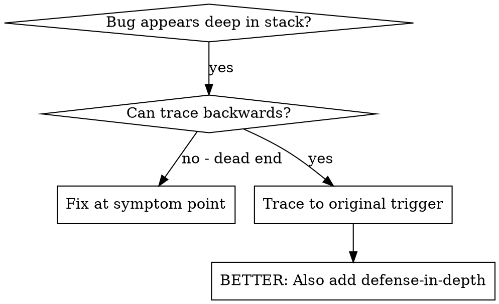
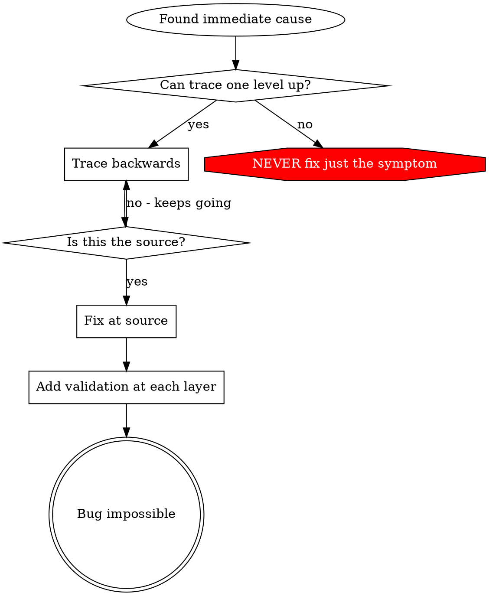

# Root Cause Tracing

## Overview

Bugs often manifest deep in the call stack (git init in wrong directory, file created in wrong location, database opened with wrong path). Your instinct is to fix where the error appears, but that's treating a symptom.

**Core principle:** Trace backward through the call chain until you find the original trigger, then fix at the source.

## When to Use



**Use when:**
- Error happens deep in execution (not at entry point)
- Stack trace shows long call chain
- Unclear where invalid data originated
- Need to find which test/code triggers the problem

## The Tracing Process

### 1. Observe the Symptom
```
Error: git init failed in ~/project/core
```

### 2. Find Immediate Cause
**What code directly causes this?**
```java
new ProcessBuilder("git", "init")
    .directory(projectDir.toFile())
    .start();
```

### 3. Ask: What Called This?
```
WorktreeManager.createSessionWorktree(projectDir, sessionId)
  → called by Session.initializeWorkspace()
  → called by Session.create()
  → called by test via Project.create()
```

Java hands you this for free — read the exception's stack trace bottom-up. If there's no exception yet, make one: `new Throwable("trace").printStackTrace()` at the immediate cause.

### 4. Keep Tracing Up
**What value was passed?**
- `projectDir = Path.of("")` (empty path!)
- `Path.of("")` resolves to the process working directory
- That's the source checkout!

### 5. Find Original Trigger
**Where did the empty path come from?**
```java
// Field initializer runs at construction — before @BeforeEach assigns tempDir!
private TestContext context = setupCoreTest(); // context.tempDir() still empty
Project.create("name", context.tempDir());
```

## Adding Stack Traces

When you can't trace manually, add instrumentation:

```java
// Before the problematic operation
void gitInit(Path directory) throws IOException {
    System.err.println("DEBUG git init: dir=" + directory
        + ", cwd=" + Path.of("").toAbsolutePath()
        + ", test.mode=" + System.getProperty("test.mode"));
    new Throwable("git init call site").printStackTrace();

    new ProcessBuilder("git", "init").directory(directory.toFile()).start();
}
```

**Critical:** Use `System.err.println()` in tests, not a logger — logging config may suppress it, and surefire captures stderr per test.

**Run and capture:**
```bash
mvn -pl <module> test 2>&1 | grep -A 20 'DEBUG git init'
```

Surefire also writes per-class output to `target/surefire-reports/<TestClass>-output.txt` — that tells you which test class produced the debug lines.

**Analyze stack traces:**
- Look for test class names (`*Test.java` frames)
- Find the line number triggering the call
- Identify the pattern (same test? same parameter?)

## Finding Which Test Causes Pollution

If something appears during tests but you don't know which test:

Use the bisection script `find-polluter.sh` in this directory:

```bash
./find-polluter.sh '.git' core
```

Runs test classes one-by-one via `mvn -Dtest=...`, stops at the first polluter. See script for usage.

## Real Example: Empty projectDir

**Symptom:** `.git` created in `core/` (source code)

**Trace chain:**
1. `git init` runs in the working directory ← `Path.of("")` resolved there
2. WorktreeManager called with empty projectDir
3. Session.create() passed the empty path
4. Test read `context.tempDir()` from a field initializer
5. Field initializers run before `@BeforeEach` — tempDir not yet assigned

**Root cause:** Field initialization accessing state that only exists after `@BeforeEach`

**Fix:** Made `tempDir()` an accessor that throws `IllegalStateException` if read before setup

**Also added defense-in-depth:**
- Layer 1: Project.create() validates directory
- Layer 2: WorkspaceManager validates not empty
- Layer 3: `test.mode` guard refuses git init outside `java.io.tmpdir`
- Layer 4: Stack trace logging before git init

## Key Principle



**NEVER fix just where the error appears.** Trace back to find the original trigger.

## Stack Trace Tips

**In tests:** Use `System.err.println()` not a logger — logger config may suppress it
**Before operation:** Log before the dangerous operation, not after it fails
**Include context:** Directory, working directory, relevant system properties, timestamps
**Capture stack:** `new Throwable().printStackTrace()` shows the complete call chain; for the cleaner API use `StackWalker.getInstance().walk(...)`
**Surefire reports:** `target/surefire-reports/` keeps per-class stdout/stderr — check it before re-running

## Real-World Impact

From debugging session (2025-10-03):
- Found root cause through 5-level trace
- Fixed at source (accessor validation)
- Added 4 layers of defense
- 1847 tests passed, zero pollution
